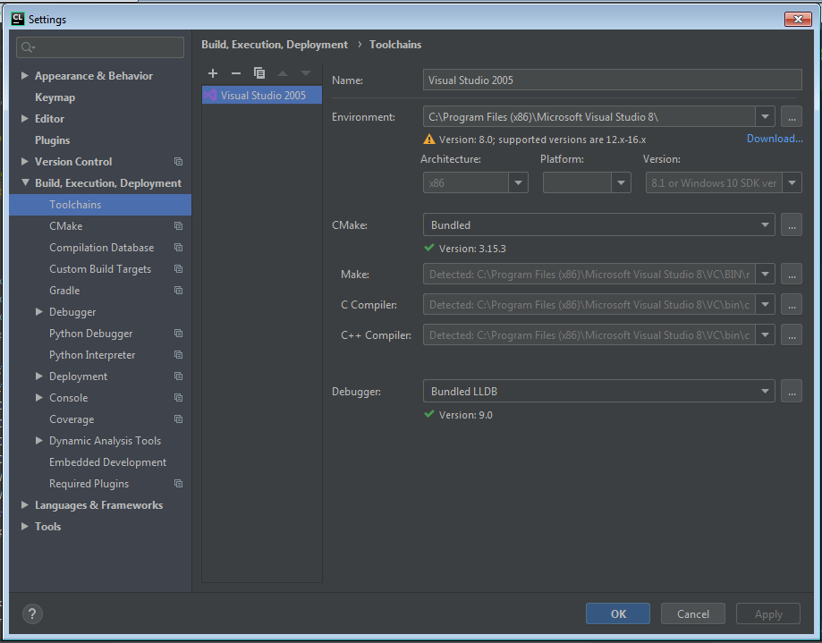
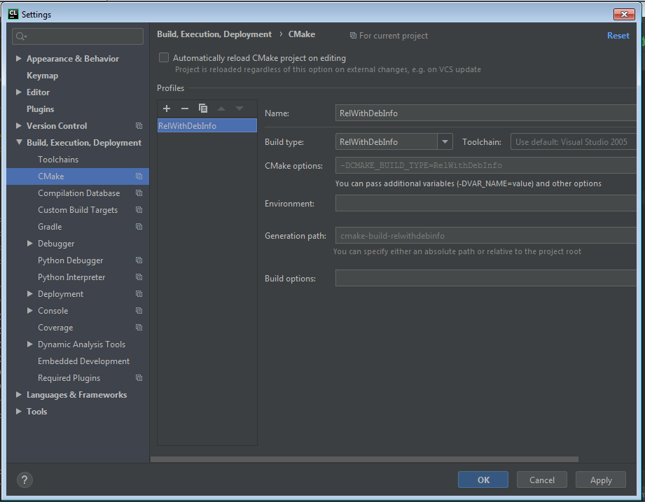
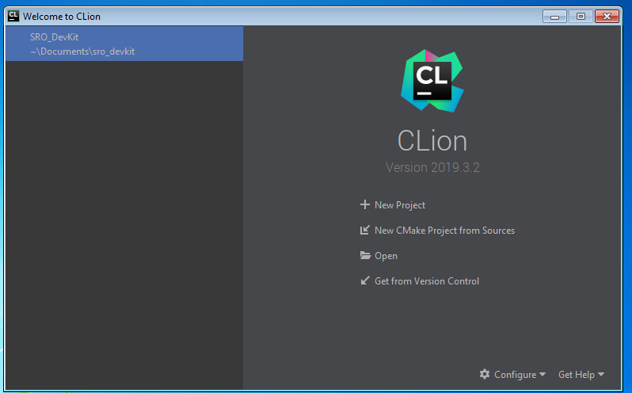
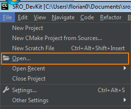
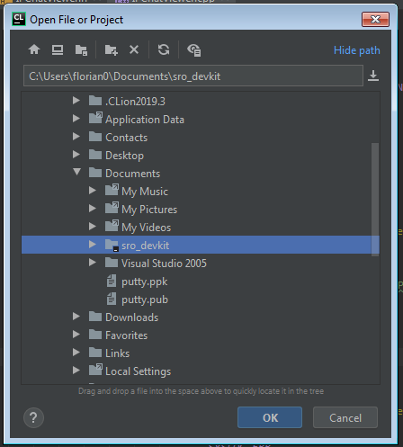
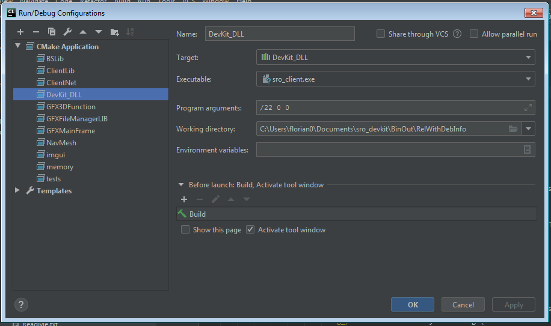

# Setup Jetbrains CLion IDE

CLion is my favourite C++ IDE by far. Microsofts Visual Studio can't stand a chance against what CLion has to offer. The autocompletion is superior and works out of the box without random dropouts or errors. CLion doesn't have stupid project files, it just works with CMake. CLion supports all compilers CMake supports, works cross platform and has no problems when updating or downgrading from other versions whatsoever (this alone puts it above any Visual Studio version by far).

**Downside**: CLion not free of charge. CLion costs 89.00 € a year (and gets cheaper the following years) which is a fair price for what you get. 

!!! tip "Get CLion for free!"
    You get free access to every EAP (Early Access Program) version released. If you're a student, you get all Jetbrains Products, including CLion, for free.

[https://www.jetbrains.com/clion/buy/#personal](https://www.jetbrains.com/clion/buy/#personal)

If you want to give CLion a try, you can use the 30-days trial. 

## Prepare CLion

Most important step: Install [Visual Studio 2005](visual-studio/2005.md) and CLion.

### Add the Toolchain

In order to add Visual Studio 2005 as a compiler, we need to make a small change so CLion can detect it.

#### 1. Patch Visual Studio 2005

CLion requires the environment variable `%VisualStudioVersion%` to be present. Visual Studio 2005 does not populate this environment variable, therefore CLion will only state *Not found* when simply adding Visual Studio 2005 as a toolchain.

Change this file `%VS80COMNTOOLS%vsvars32.bat` and add this line at a appropriate location.

```batch
@set VisualStudioVersion=8.0
```

If you can not find this file, press `Win + R` on your keyboard, enter `%VS80COMNTOOLS%` in the dialog and press enter. The explorer should open and you can open `vsvars32.bat` from there.

#### 2. Add Toolchain

Next add Visual Studio 2005 as a toolchain in CLion. Choose the root path of your Visual Studio install, e.g. `C:\Program Files (x86)\Visual Studio 8.0\`

CLion should then properly detect Visual Studio 2005. It will warn you about the version, but that's okay for now.



#### 3. Add Release-Build configuration

For some reason, debug builds fail to execute with return code `0xC0000135` (STATUS_DLL_NOT_FOUND). Debug builds are linked against msvcXX**d**.dll versions, which for some random reason can't be found.

A workaround is to just add the `Release`-configuration in CLion and stick to that until a better solution is available.

Since SRO_DevKit only supports building on Release, this is not an issue for us.



# Working with CLion

## Opening the project

Clone the project using Git (don't forget the submodules) into a folder of your choice. After that you can open the project. When starting CLion it either shows you a welcome screen with your recent projects, or it goes straight to IDE-mode.



In case you don't get the welcome window, you can open the project by clicking "File -> Open"



In the following dialog, select the folder containing the SRO_DevKit project. CLion automatically marks valid project folders with a small icon.



## Run configuration

CLion can run the `sro_client.exe` for you. You just need a valid configuration. SRO_DevKit automatically deploys the Dll to a folder called `BinOut`. The recommended build configuration is `RelWithDebInfo` (Meaning "Release with debug info"). When you put a working Silkroad Client into that folder, CLion can run the client using the following configuration:

 
