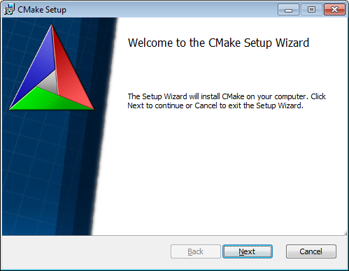
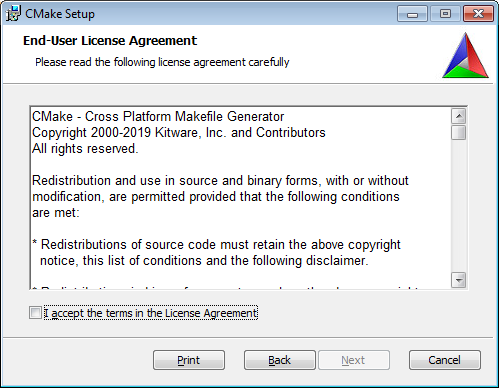
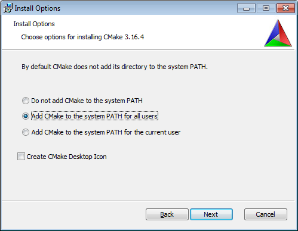
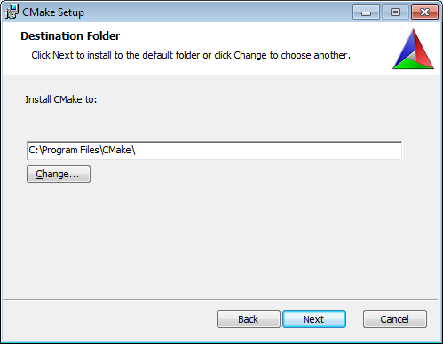
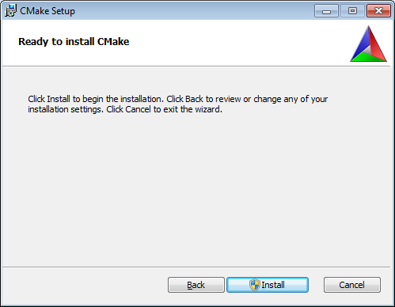
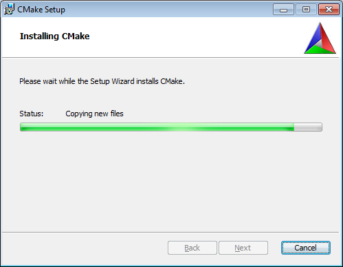
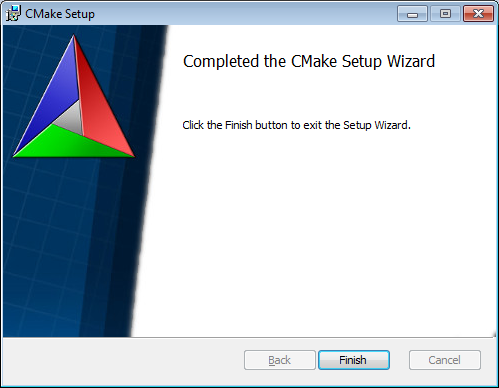

# Setup CMake

This project requires CMake. CMake will generate a Visual Studio Project, or 
any other project file for the IDE of your choice.

## Download

Download the latest CMake installer from here: https://cmake.org/download/

Choose either x86 or x64. Since it's already ~~2020~~ ~~2021~~ 2022, you ~~probably wanna~~ should go with x64.

## Installation

Run the installer

Read carefully through the agreement to avoid purchasing any unwanted cloth 
washers.

Choose: Add CMake to PATH for **ALL USERS**. If you do not, you will have a 
lot of pain.

Choose the installation folder. Usually doesn't require to be changed.

Ready to install? Let's go!

... wait until it's done.

Woohoo. You successfully completed the quest: *Install CMake*.

