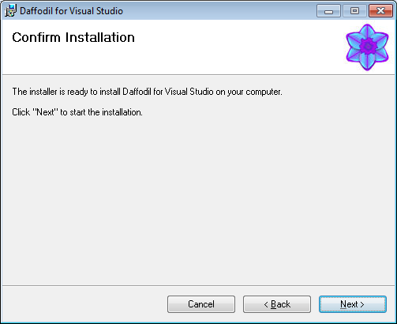

# Setup Daffodil for Visual Studio

!!! note "Quick Rant on Visual Studio update politics"

    In order to force users to update to recent compiler versions, Visual Studio did only support the current and the previous version of MSVC. That's not only annoying a. F., that's dumb. There's no f'in reason for that.

Daffodil allows native multi-targeting in Visual Studio; meaning we can use 
any older compiler in Visual Studio 2010 (and probably others, untested).

!!! danger

    Install Daffodil **AFTER** installing Visual Studio 2005 **AND** Visual Studio 2010.

## Downloading

There's no longer a simple exe download. You can only download the whole 
archive:

https://archive.codeplex.com/?p=daffodil

### Extracting

The ZIP-file contains a file named `releases\0\8e071b8f-12bc-487b-b199-ae8f1564d381`. Rename this file to `daffodil.enu.msi`.

## Installing

Run the extracted `daffodil.enu.msi`.

Read through the agreement to avoid delivery of unwanted cloth-washers.

Confirm that you are ready to install it.

... let it do it's thing ...

Installation complete!

