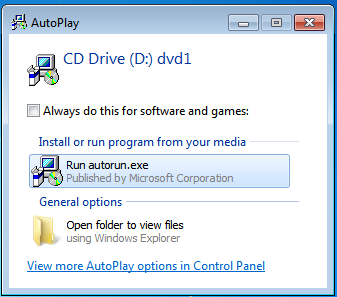
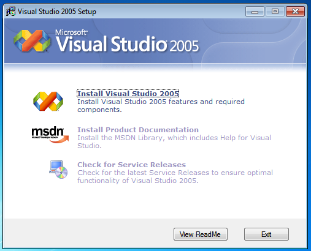
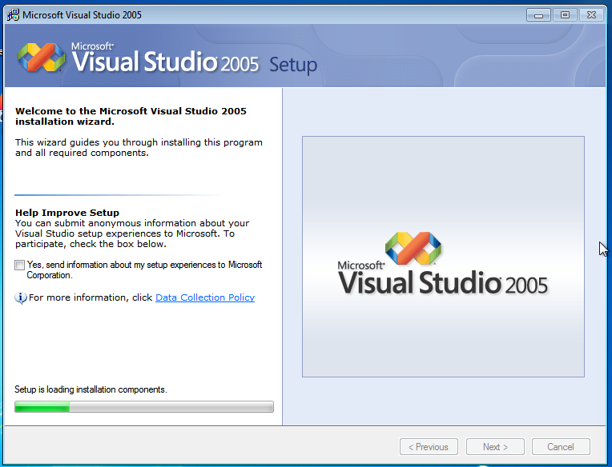
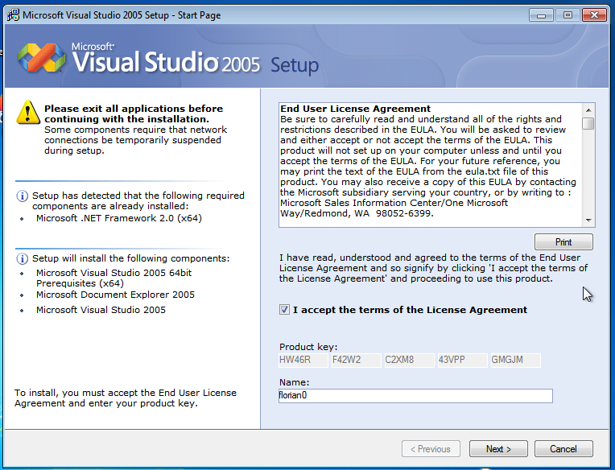
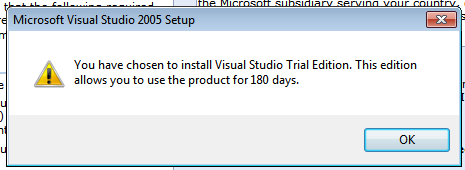
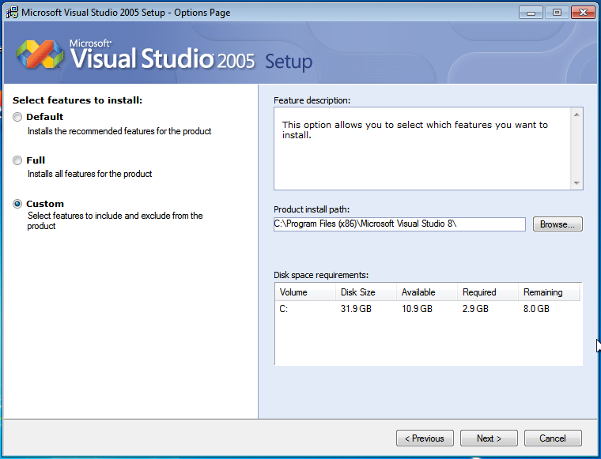
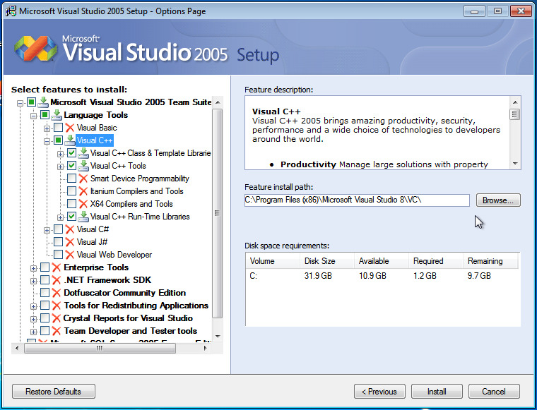
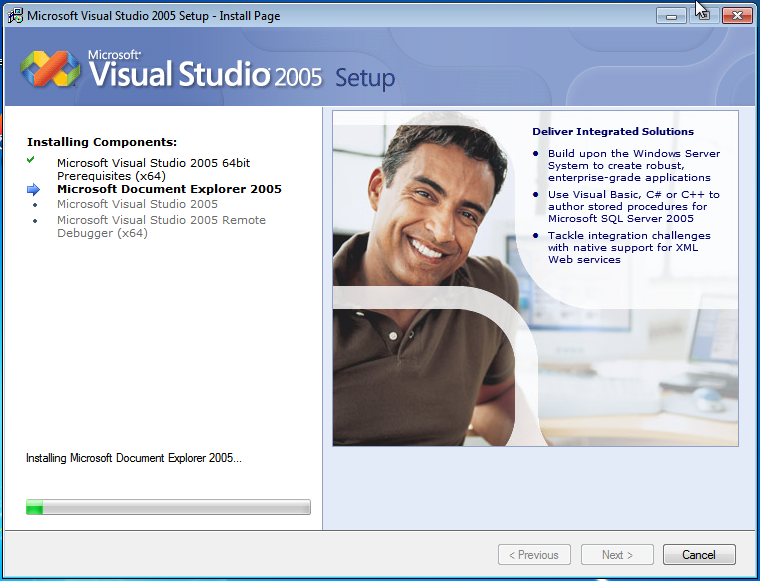

# Setup Visual Studio 2005

SRO_DevKit depends on Visual Studio 2005, on the Standard Template Library (STL) of Visual Studio 2005 to be exact.

This page describes how to setup Visual Studio 2005 properly.

!!! tip "Which version?"

    Many people just download a random version without knowing that there are differences to them. 

    Express versions do not come with the Windows SDK (Windows.h and others). This is a stupid decision by Microsoft, but there's nothing we can do about that. That's why you can not use any Visual Studio 2005 Express version.

    We recommend using at least the Professional version. If you can get your hands on a license, that's good. If not, you can use the trial version without any problems.
    Specialized versions like the "Team Suite" work, too, but are completely over engineered for this scope.

    
    Download Visual Studio 2005 (128 days trial):

    * [Download (Microsoft)](https://download.microsoft.com/download/6/f/5/6f5f7a01-50bb-422d-8742-c099c8896969/En_vs_2005_vsts_180_Trial.img)
    * [Mirror: archive.org](https://archive.org/details/Microsoft_Visual_Studio_2005_180-Days_Trial)

# Installation

After inserting the disk (or mounting, or whatever), run the installer:

Wait for the installer to come up, then choose "Install Visual Studio 2005".

Wait while the installer loads the necessary data. Once it is finished, click "Next".

Read through the EULA carefully to avoid accidentally selling your soul or 
your firstborn to Microsoft, then tick the box and click "Next".

The key shown in the previous picture is a trial key. We're allowed to use Visual Studio 2005 for 180 days. After that period, it will no longer allow to be opened. This is no problem for us since we never planned to use Visual Studio 2005 at all. We just want to use the compiler.

If you are in a hurry, choose "Default", if you have lots of disk space to waste, choose "Full", and if you are a scrooge like me, choose "Custom".

If you choose Custom, disable everything but C++. You can disable even more. Just reproduce the configuration on the screenshot. Press "Next" to start the installation.

Enjoy the pictures of all these happy people who's favourite IDE from 2005 was turned into the worst IDE on the planet. Wait for the installation to finish. After that, Visual Studio 2005 is properly installed and ready to use.

