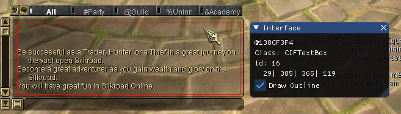
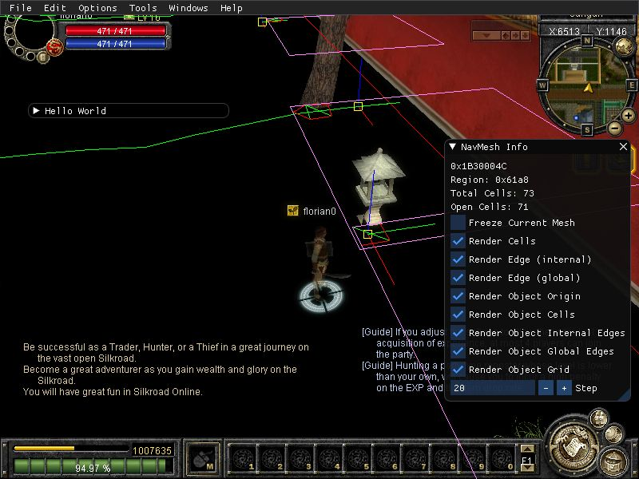
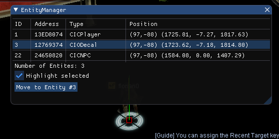
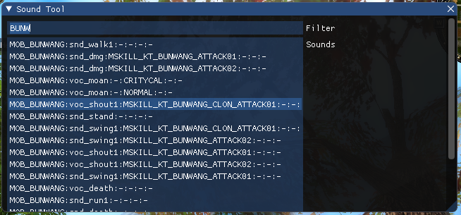

# Features

SRO_DevKit is a development framework. It allows all kinds of modifications,
while some are easier and some are not so easy to accomplish. The current
feature-set is targeted towards creating user-interfaces and accessing
existing ones. However the goal is to make any modification easier by
supplying the right tools.

The *best* developed functionalities are:

* Creating basic user interfaces
* Accessing existing user interfaces
* Sending network messages

Other functionalities, such as coloring names or titles, are possible, too,
but require more work.

## Development Helpers

SRO_DevKit comes with several internal tools that showcase interaction with
game data, but also support your development.

### Interface Explorer

Shows information about the UI-element the
cursor points at. Similar to the `/frame` command. 

* Draw a rectangle around the element
* Shows the type name
* Show the dimensions
* Show the id
* Show the address

### Quick Start

Joymax included a Quick Start feature which skips the visual part of the 
login. The credentials are stored in a file in the settings folder of your
client. The image code (IBUV) can not be shown. It must be hardcoded to a 
certain value, or skipped entirely.

### Navmesh Explorer

Renders the edges of the Navmesh in the 3D view of the client. Helps debugging
collision issues and object placement. Can also be used to find (and fix) collision 
glitches.

### Entity Explorer

Entity Explorer allows you do inspect the objects surrounding your character. It 
shows the ID, the address, the type and the location of the object. Additionally 
you can highlight the object you selected and trigger a move command.

!!! info "Walking to NPCs"
    The move-button uses the same code the *click on the ground*-function uses. 
    Therefore you can not walk close to or into an NPC.

### Sound Tool

Sound Tool lists all sound effects loaded. You can play any effect by 
clicking on it. The filter offers a full text search.

