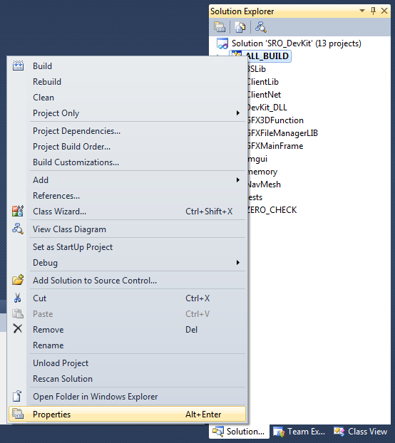
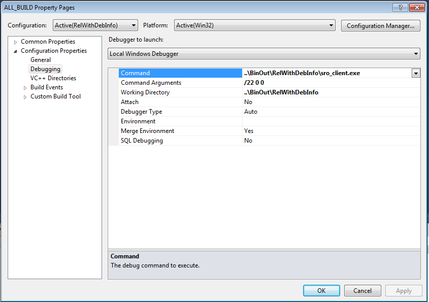
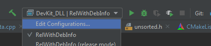
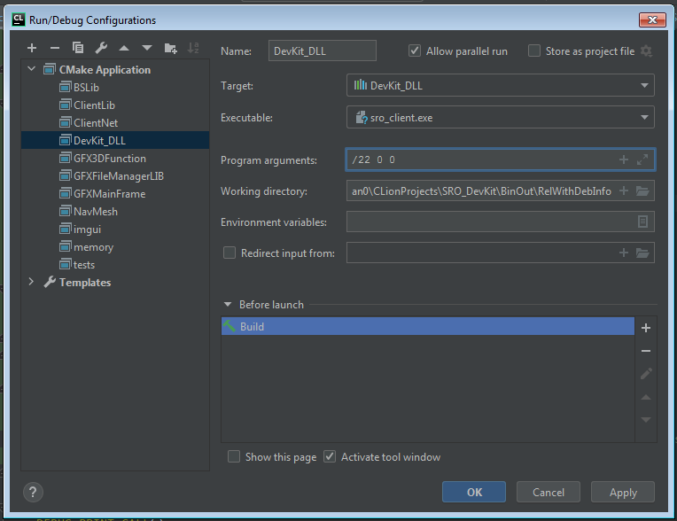

# Getting started

SRO_DevKit uses a number of different tools you might not have dealt with,
yet. This page contains all the information you need to download the 
project, set up your build environment and compile the project successfully.

## Is this project right for me?

* This project is a work in process. It is not flawless. Things will change 
as development continues and the project evolves. If you want something ready to 
use, this project ain't for you.
* This project requires personal initiative. We don't have step by step guides for everything, 
and we won't create such any time soon. If you do not want to take the initiative and don't 
want to figure things out on your own, this project is not for you.
* This project uses C++. There is no way to get around C++. If you don't want to deal 
with C++, this project is not for you.
* Overall, this project requires you to learn new skills and work on your own. If, for whatever reason, 
you cannot do that, this project is not for you.
* The contents of this documentation have been written carefully to ensure proper setup 
of your build environment. Following all the steps will ensure the correct setup of your 
build environment. If you're unable to follow simple steps shown on screenshots and read texts 
without skipping to the end, this project is not for you.

## Download the project

The project is making use of Git. You need to install 
[Git](https://git-scm.com/) in order to download the project successfully. After
that, open the *Git Bash* in the folder of your choice (it's hidden in the 
context menu of the explorer).

Enter the following command to download the project using Git.

```bash
git clone --recurse-submodules https://gitlab.com/florian0/SRO_DevKit
```

Git will now download the project. Wait until it is done. The whole project is 
stored in a folder named `SRO_DevKit` at the location you opened the *Git Bash*
at.

!!! warning "Do NOT download directly from Gitlab"

    Please do not use the download button embedded in Gitlab. It might sound 
    easier at first, but it is not. There's a reason why this step is more than
    *"just download everything"*: We are relying on submodules. Submodules 
    allow us to include external code from other repositories without copying 
    it to this repository. This keeps the repository itself clean. 
    In our case, DirectX and ImGui are fetched from external sources.


## Setup your build environment

SRO_DevKit relies on Visual Studio 2005. Nobody will use Visual Studio 2005 by 
choice, for sure. That's why this project uses CMake to support a variety of 
Visual Studio Versions, and also other IDEs aswell.

Choose your favourite IDE from the list below. 

!!! info "Undocumented Visual Studio versions"
    
    Most Visual Studio versions seem to work if you follow the guide for Visual
    Studio 2010. Please let us know if any additional steps were required.

| IDE                                               | Compile               | Debug        | Rating     |
|---------------------------------------------------|-----------------------|--------------|------------|
| [Jetbrains CLion](build-environment/clion.md)     |  ✅ Working            | ✅ Working    | ⭐⭐⭐⭐⭐     |
| Visual Studio 2008                                |  ❔ Unknown            | ❔ Unknown    | ❔ Unrated |
| [Visual Studio 2010](build-environment/visual-studio/2010.md)    |  ✅ Working            | ✅ Working    | ⭐⭐⭐   |
| Visual Studio 2012                                |  ❔ Unknown            | ❔ Unknown    | ❔ Unrated |
| Visual Studio 2013                                |  ❔ Unknown            | ❔ Unknown    | ❔ Unrated |
| Visual Studio 2015                                |  ❔ Unknown            | ❔ Unknown    | ❔ Unrated |
| Visual Studio 2017                                |  ❔ Unknown             | ❔ Unknown     | ❔ Unrated |
| [Visual Studio 2019](build-environment/visual-studio/2019.md) |  ✅ Working            | ✅ Working    | ❔ Unrated |
| Visual Studio Code                                |  ❗ Not easy to set up | ❔ Unknown    | ❔ Unrated |
| Code::Blocks                                      |  ❔ Unknown            | ❔ Unknown    | ❔ Unrated |
| CodeLite                                          |  ❔ Unknown            | ❔ Unknown    | ❔ Unrated |
| Netbeans IDE                                      |  ❔ Unknown            | ❔ Unknown    | ❔ Unrated |
| Qt Creator                                        |  ❔ Unknown            | ❔ Unknown    | ❔ Unrated |
| Dev-C++                                           |  ❔ Unknown            | ❔ Unknown    | ❔ Unrated |
| Eclipse                                           |  ❔ Unknown            | ❔ Unknown    | 💩         |

> ✅ Everything is fine
> ❗ Known issues existing
> ❌ Requires lot of work or is just undoable

If you got any issues regarding these configurations, please create an issue so
we can improve the documentation.

## Compile the project

SRO_DevKit does not come with "ready to use" project files. Instead, we use 
CMake to generate project files for each IDE.

!!! help "Why not just put a Visual Studio project"

    Dealing with Visual Studio projects/solutions in version control systems 
    like Git has always been a pain. Visual Studio keeps changing a lot of 
    values (e. g. UUIDs) which results in a lot of changes in Git and almost 
    always in a merge conflict. Since files are not meant to be human-readable,
    merging two conflicting files is a nightmare.
    
    People use different Visual Studio versions. We can not make a project for 
    every version, and with up- and downgrading, things get even messier.
    
    We don't have any of these problems with CMake as CMake-files are human-
    readable and independed of any IDE.
    
    Lastly, the maintainer of this project is not using Visual Studio at all.
    All development is done in CLion which works on CMake by default.

### ... with Visual Studio

After following the guide to setup your Visual Studio based build environment,
you are ready to create the project files.

Check out the `helpers/`-folder in the project directory. Run the file 
`make_project_vs2010.cmd` by doubleclicking on it. This will run CMake with the
correct arguments to generate a compatible Visual Studio project.

The helpers folder should now contain a Visual Studio project you can open. 
After opening, make sure to select "RelWithDebInfo" from the build 
configuration dropdown. Visual Studio selects Debug by default and Debug is not
working.

You can find the built DLL in the `BinOut/` folder.

!!! failure "Troubleshooting"
    
    If you can not see a Visual Studio project after running 
    `make_project_vs2010.cmd`, open the file and add a `pause` in a new line 
    at the end. Save, then run it again. The console window should now stay 
    open and you can read the error message.
    
    If it states *cmake.exe Command not found*, make sure you installed CMake 
    correctly. Double check the settings regarding "Add CMake to PATH variable".
    Refer to the CMake Setup Guide if in doubt.
    
    If it states something about imgui or directx files not found, make sure you 
    downloaded the project using Git, and not with the download button on 
    GitLab.
    
    If it returns the following message, you did not install Visual Studio 2010, or something went wrong during installation.
    > The imported project "C:\Microsoft.Cpp.Default.props" was not found. Confirm that the path in the <Import> declaration is correct, and that the file exists on disk.
    
    
    

### ... with CLion

After adding Visual Studio 2005 to CLion, simply open the project. Choose 
`DevKit_DLL | RelWithDebInfo` from the build configuration dropdown if not 
already choosen. After that click the little hammer-icon to start the build.

You can find the built DLL in the `BinOut/` folder.

## Configuration

SRO_DevKit offers several configuration options. Depending on your needs, 
you can easily enable or disable predefined features with CMake-options. 
The following options are configureable:


| Option | Description | Default value |
|--------|-------------|---------------|
| CONFIG_TRANSLATIONS_DEBUG | Print Tokens instead of translated strings | OFF |
| CONFIG_OLD_UNDERBAR | Turn the old EXP Bar ON/OFF | OFF |
| CONFIG_CHATVIEWER | Use the custom chatviewer supplied in SRO_DevKit | OFF |
| CONFIG_CHATVIEWER_BADWORDFILTER | Enable the Bad Word Filter | ON |
| CONFIG_IMGUI | Enable ImGui | ON |
| CONFIG_DEBUG_REDIRECT_PUTDUMP | Redirect the PutDump output to the console | ON |
| CONFIG_DEBUG_CONSOLE | Show the debug console | ON |
| CONFIG_DEBUG_NET_RECEIVE | Print NetProcess debug messages on receive | OFF |


To change one of these options, alter the CMake command in `helpers/make_project_vs2010.cmd` to include the option.

!!! example
    To override the ChatViewer with the one supplied in SRO_DevKit, add `-DCONFIG_CHATVIEWER=ON` to the CMake command.
    ```
    cmake -G "Visual Studio 10 2010" -T v80 -DCMAKE_BUILD_TYPE=RelWithDebInfo -DCONFIG_CHATVIEWER=ON ..
    ```

## Run & Debug

You need to inject the Dll into your client with the method of your choice. This is not covered here. This section
covers how to run the client from your IDE.

Independent of your IDE, you need to copy a working client to the `RelWithDebInfo`-folder. Make sure to copy it where 
the resulting Dll can be found. 

### ... with Visual Studio

First, open the project settings of the `ALL_BUILD`-project. This project should always be the startup project.



Make sure you're editing the *RelWithDebInfo*-configuration. Editing any other will get you nowhere. Select 
*Debugging* on the left. Select your client as the command, set `/22 0 0` as the command arguments and set the working 
directory accordingly.



You can now run and debug in Visual Studio.

### ... with CLion

First, open the *Run/Debug Configurations* Editor in Clion.

 

Then set the *executable* to your client binary and the program arguments to `/22 0 0`.



After this you can use both the Run and the Debug button.

## Working with Git

Using *Git* will come in handy, even if you don't plan to contribute. It allows you to track your changes, figure out 
where a bug was introduced, and ultimately update the project to the latest version easily.

A full guide on working with Git can be read [here](working-with/working-with-git.md).

### Staying up to date / Updating

Integrating updates can be hard, especially in a growing project with many files. Using Git to update is 
highly recommended. To use Git to update, you have to use Git at all. Track your changes on our own branch. 
 
First, create a branch with a name of your choice. Check out this branch and track your changes.

!!! example
    Create a branch
    ```
    git branch mybranch
    ```
    Check out the branch
    ```
    git checkout mybranch
    ```
    List the files you have changed
    ```
    git status
    ```
    Add the files
    ```
    git add file1.cpp file1.h file2.cpp
    ```
    Commit the files to store them in git
    ```
    git commit -m "Write here what you changed"
    ```
    
After that pull the most recent version from the repository and merge it with your created branch.

!!! example
    Pull all branches
    ```
    git pull
    ```
    While being on your own branch created in the step before, run
    ```
    git merge devel
    ```
    This will merge all changes into your own code, respecting all changes you made.
    
    
After merging, recreate the Visual Studio project (if needed) by running `make_project_vs2010.cmd` again.
